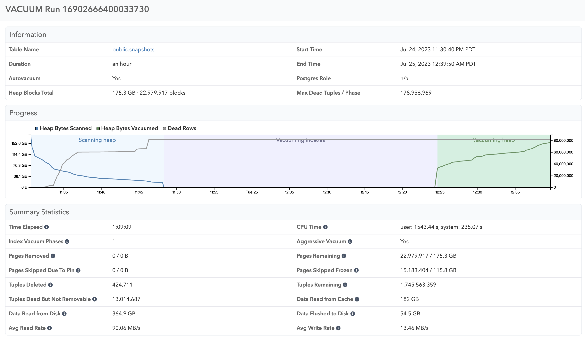

If you want to understand which VACUUM processes are currently running, for example to explain higher I/O usage,
you can see this information in the Activity tab. Here you can all currently running vacuums and autovacuums,
a history of all VACUUM runs, how long they ran for, and when the process finished.

You can click on individual tables to see a visualization of an individual VACUUM run, as well as summary
statistics that are collected when `log_autovacuum_min_duration` is turned on:

