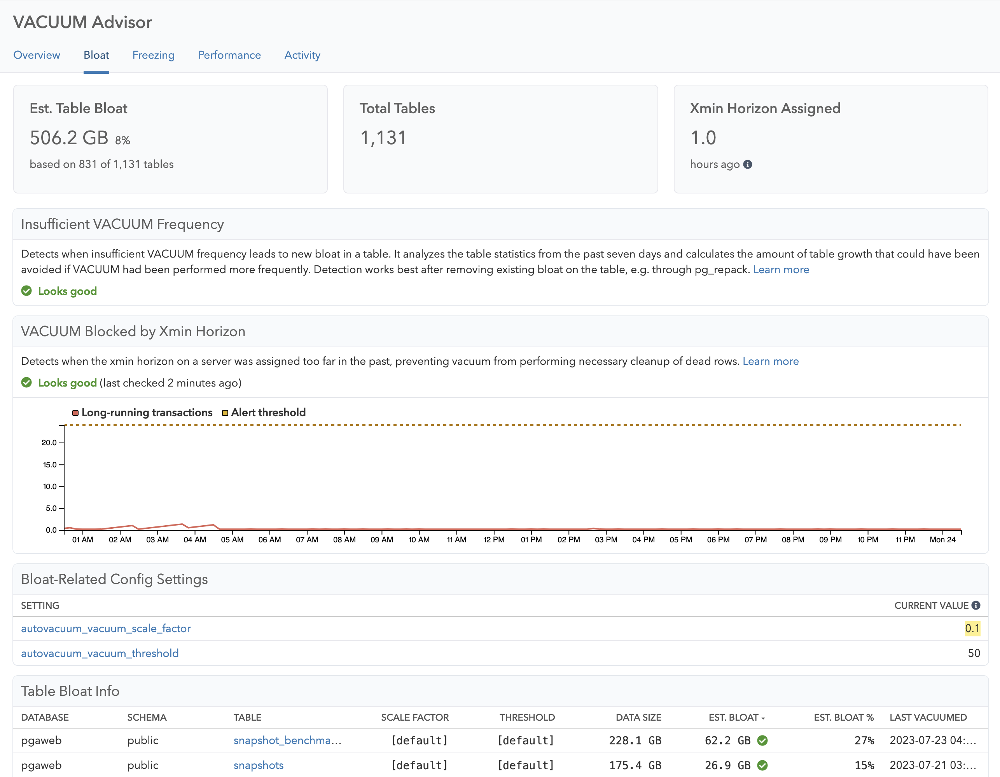

The Bloat page in VACUUM Advisor shows you everything related to table bloat. Note that index bloat is not yet included in the current version of VACUUM Advisor.

You can see bloat estimates for each table, find insights that recommend tuning `autovacuum_vacuum_scale_factor` and `autovacuum_vacuum_threshold` on a per-table basis, and know right away when the xmin horizon holds back VACUUM operations.

## Metrics

For the key performance indicators (KPIs), you can see:

* **Est. Table Bloat**: The estimated overall table bloat on this server or database - this is a very rough estimate and should be reviewed for individual tables.
* **Total Tables**: The total number of tables on this server or database - databases with a lot of tables can often times suffer from more autovacuum scheduling challenges.
* **Xmin Horizon Assigned**: How long ago the xmin horizon was assigned, indicating up to which point VACUUM can clean up dead rows.

Additionally, the Bloat page shows:

* Visualization of the xmin horizon over time, which helps you understand trends that cause VACUUM to not perform any work due to "dead tuples not yet removable".
* Per-table bloat estimates, as calculated by the difference of the actual table size, compared to the average row size * number of rows in the table.

[Learn more about bloat in Postgres](/docs/vacuum-advisor/bloat-in-postgres)

## Insights

* [Bloat - Insufficient VACUUM Frequency](/docs/checks/vacuum/insufficient_vacuum_frequency)
* [Bloat - VACUUM Blocked by Xmin Horizon](/docs/checks/vacuum/xmin_horizon)