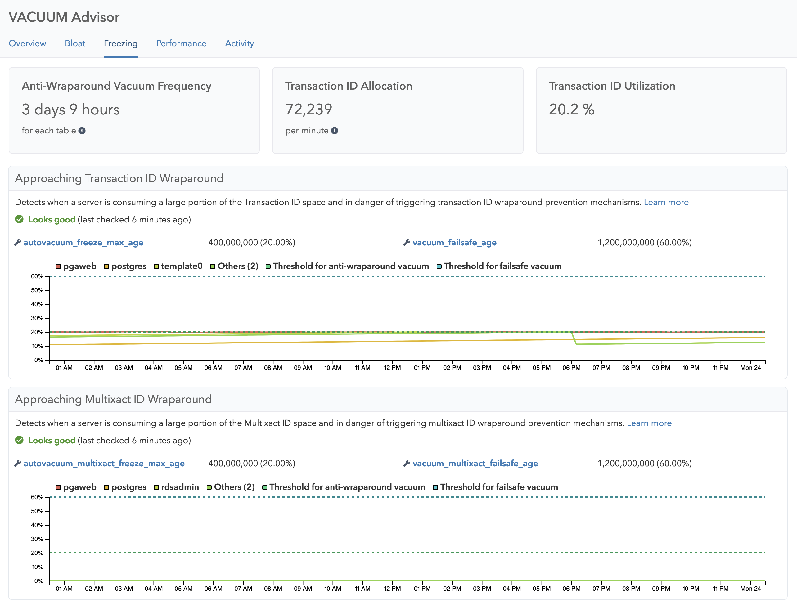

The Freezing page in VACUUM Advisor gives you detailed insights on the freezing process - a routine operation that has to happen on each and every Postgres database, in order to make transaction IDs (which are a 32-bit sized counter) re-usable. In addition, this page also tracks the consumption and potential wraparound of multixact IDs, which are special identifiers used for row-level locking in Postgres.

You can see the rate of transaction ID and multixact IDs over time, which is the most important metric to know in terms of freezing. The more IDs you are consuming, the more often autovacuum will have to visit each and every table, to perform freezing. If the freezing operation does not keep up, you will see transaction ID space utilization % increase in the respective graphs, and potentially send alerts.

## Metrics

For the key performance indicators (KPIs), you can see:

* **Anti-Wraparound Vacuum Frequency**: How often an Anti-Wraparound VACUUM is estimated to be scheduled on each table - this is a function of the rate of transaction ID consumption, as well as the `autovacuum_freeze_max_age` and `vacuum_freeze_min_age` settings. Higher values are better.
* **Transaction ID Allocation**: The rate of transaction IDs that are allocated per minute, as averaged over the last 24 hours. Higher allocation rates generally mean more freezing will be required.
* **Transaction ID Utilization**: How much transaction ID space is utilized among the actual maximum available transaction IDs, in percent.

Additionally, the Freezing page shows:

* Visualization of transaction ID and multixact ID allocations over time, to help you understand if the workload had increased periods where more IDs were used

## Insights

* [Freezing - Approaching Transaction ID Wraparound](/docs/checks/vacuum/txid_wraparound)
* [Freezing - Approaching Multixact ID Wraparound](/docs/checks/vacuum/mxid_wraparound)
