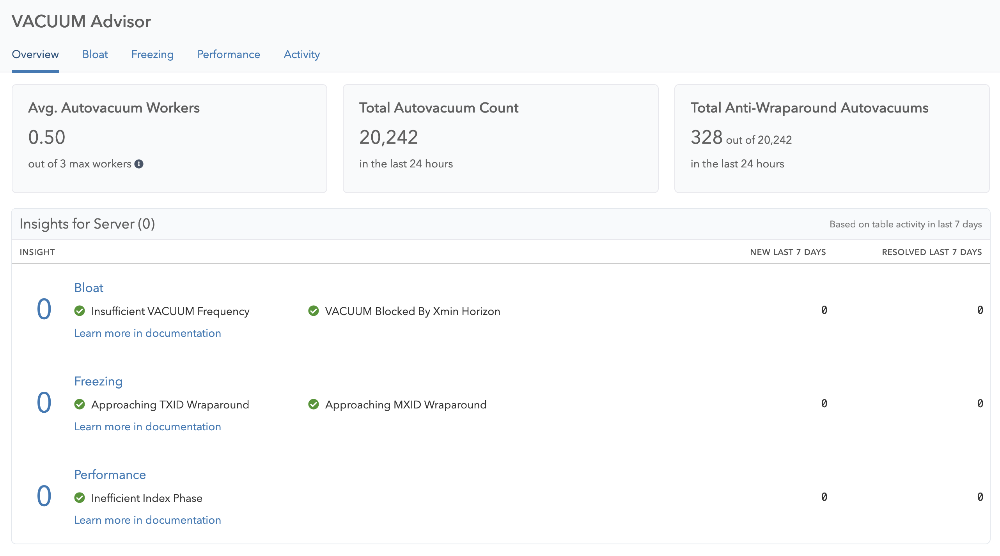

The VACUUM process is critical because it removes dead rows or unused data from tables and indexes, freeing up space for new data and improving query performance. Without VACUUM, the database is prone to suffer from database bloat, which can impact query performance and reduce system stability over time. By regularly running VACUUM operations, you can prevent database bloat, optimize query performance, and ensure the long-term stability of your database system.

The pganalyze VACUUM Advisor is a tool to observe VACUUM activity and efficiency, and suggests insights that tailor your database’s Postgres configuration to your workloads. VACUUM Advisor uses information pganalyze already collects assuming you are using the latest version of the collector.

## What you get with VACUUM Advisor

- Automatically scan your VACUUM statistics for inefficiencies, and provide insights for how to optimize your Postgres configuration.
- Find detailed insights to optimize Bloat, Freezing, and Performance issues.
- Review a prioritized list of insights, so you can quickly work through them, and understand when pganalyze has confirmed there is no action needed.
- Understand how pganalyze arrives at each insight, so you can make the final decision if and how you want to apply it.
- Share in-depth autovacuum data with the whole team, and give the data platform team, infrastructure engineers, and DBAs quick access to detailed information.
- See statistics about VACUUM activity and individual table vacuum activities over time

To get started, you first need to onboard a new database server if you have not yet.

Next, choose VACUUM Advisor in the navigation to view Bloat, Freezing and Performance metrics and insights. For new servers VACUUM metrics will be available after about 10 minutes after the first snapshot was sent by the collector, insights will show up around 24h after onboarding.

## Collector requirements

We recommend installing the latest version of the collector, as we now track more information about your workloads, including table bloat, TOAST table name, reltuples and relpages. At the very least collector [version 0.50.1](https://github.com/pganalyze/collector/blob/main/CHANGELOG.md#0501------2023-06-29) is required.

Column statistics are used by pganalyze to improve VACUUM Advisor recommendations, and calculate bloat estimates. [Set up the get_column_stats helper function](/docs/install/troubleshooting/column_stats_helper).

## How to navigate VACUUM Advisor

When you navigate to the VACUUM Advisor, you will see key performance indicators (KPIs) that capture high-level information at the top of the page:

* **Avg. Autovacuum Workers**: The utilization of your autovacuum workers - if this is close to the maximum, an autovacuum backlog may occur, causing bloat and potential freezing issues.
* **Total Autovacuum Count**: The total number of autovacuums in the last 24 hours - use this to understand how busy a server is (compared to others) in terms of its autovacuum behavior.
* **Total Anti-Wraparound Autovacuums:** The total number of autovacuums that were scheduled for anti-wraparound (freezing) reasons in the last 24 hours - if this is close to the total its likely most of the freezing work was done by anti-wraparound vacuums, causing potential excess I/O.

Continue by clicking on a category in the overview to learn about the metrics and insights you can see on the **[Bloat](/docs/vacuum-advisor/bloat)**, **[Freezing](/docs/vacuum-advisor/freezing)**, **[Performance](/docs/vacuum-advisor/performance)** or **[Activity](/docs/vacuum-advisor/activity)** pages.

On each of these pages you can see how VACUUM and autovacuum performs on your servers and databases. As pganalyze continues to collect server and workload statistics, metrics and insights will be updated automatically.

VACUUM Advisor also includes relevant config settings with each category, so you can connect them better with autovacuum's responsibilities, and see what values you are currently using for each setting.
