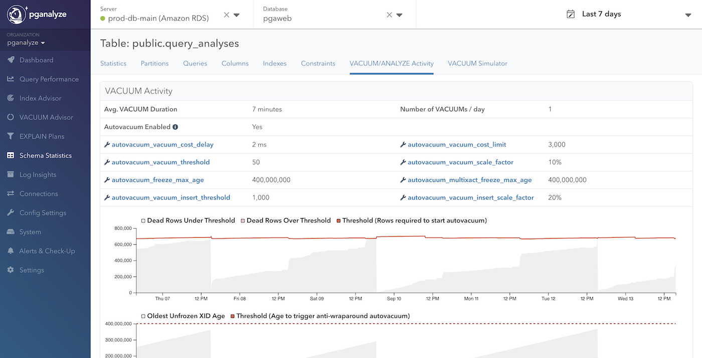

VACUUM Advisor gives you a holistic view of VACUUM Activity on your database
server. If you want to look into the details of VACUUM and ANALYZE activity of
each table, you can find it in the VACUUM/ANALYZE Activity tab in the Schema
Statistics page.

## VACUUM Activity

In the VACUUM Activity panel, you can learn information such as an average
VACUUM duration of the table, as well as number of VACUUMs per day. You can also
check out the current VACUUM related configuration of the particular table.
There are also three additional graphs displayed above the VACUUM runs graph:

* Graph of dead rows (tuples) and the threshold to start autovacuums
* Graph of the oldest unfrozen transaction ID age and the threshold to start anti-wraparound autovacuums
* Graph of inserted rows and the threshold to start autovacuums (available from Postgres 13)

When you see a VACUUM run in the VACUUM runs graph, you can usually find
a corresponding cause in above 3 graphs as long as it's autovacuum.
When autovacuum is invoked, you can observe that at least one of the graphs
exceeds or comes close to exceeding its corresponding threshold, and then the
value drops after the invocation.

Below the graphs, there is a list showing all VACUUM runs during the specified
time period. The VACUUM runs graph and this list might report fewer VACUUM runs
than actually occurred when `log_autovacuum_min_duration` is turned off, turned
on but set to a higher value, or Log Insights is not enabled.

In this list, you can check out the progress of freezing old transaction IDs or
cleaning up dead tuples (dead rows). Both processes should occur with each
VACUUM run; however, it is possible that no progress occurs under the following
situations:

* Freezing progress: when VACUUM was focusing to clean up dead tuples
* Freezing progress: there was nothing can be frozen (often true in autovacuums triggered by inserts)
* Dead tuple progress: more dead tuple created while VACUUM was running

## Estimated Table Bloat

In the Estimated Table Bloat panel, you can check out the current estimated data
and bloat size, as well as the transition of them over time. Note that this
doesn't include the index bloat. You can check out the overall bloat information
of your database in [VACUUM Advisor](/docs/vacuum-advisor/bloat).

## ANALYZE Activity

In the ANALYZE Activity panel, you can see a list of ANALYZE runs during
the specified time period.
This list might report less ANALYZE runs than actually occurred, as we only
collect this information every once a minute.
The history of ANALYZE activity is currently limited to 7 days.
