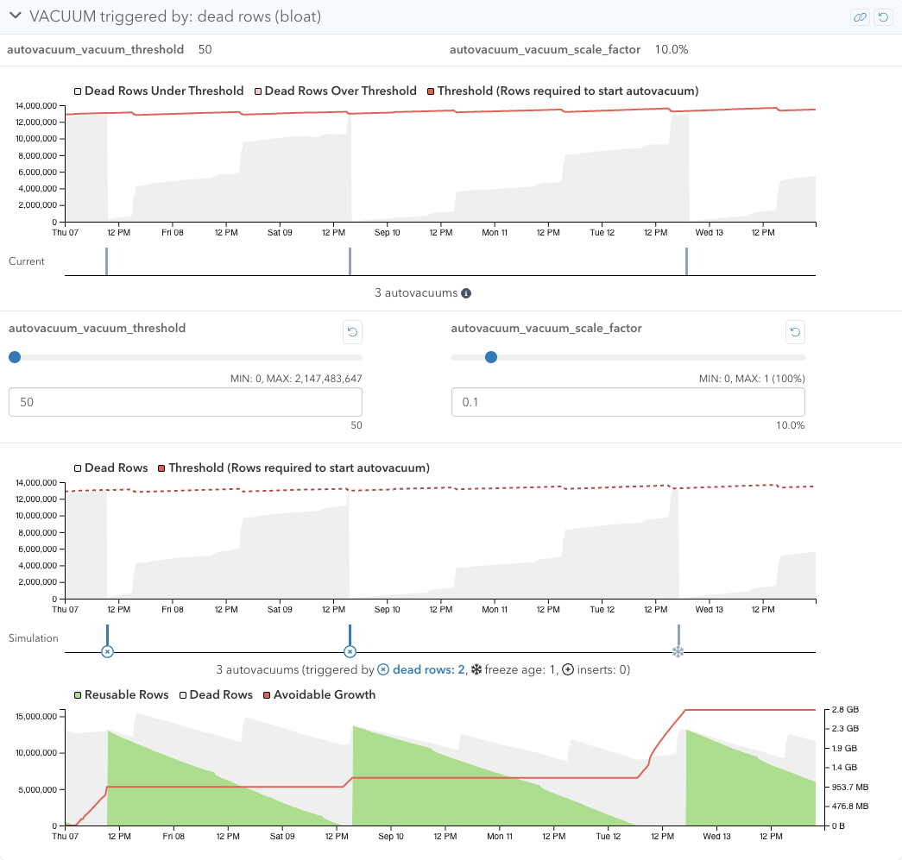
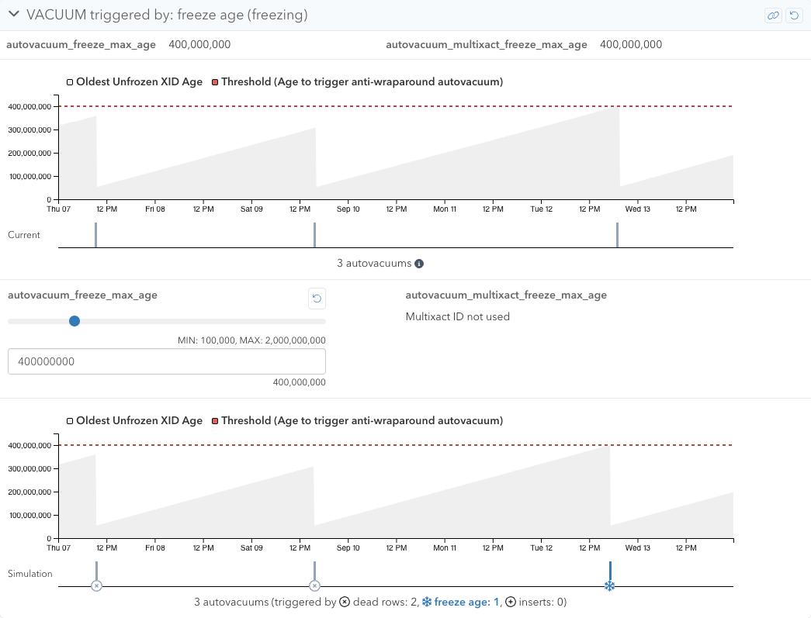
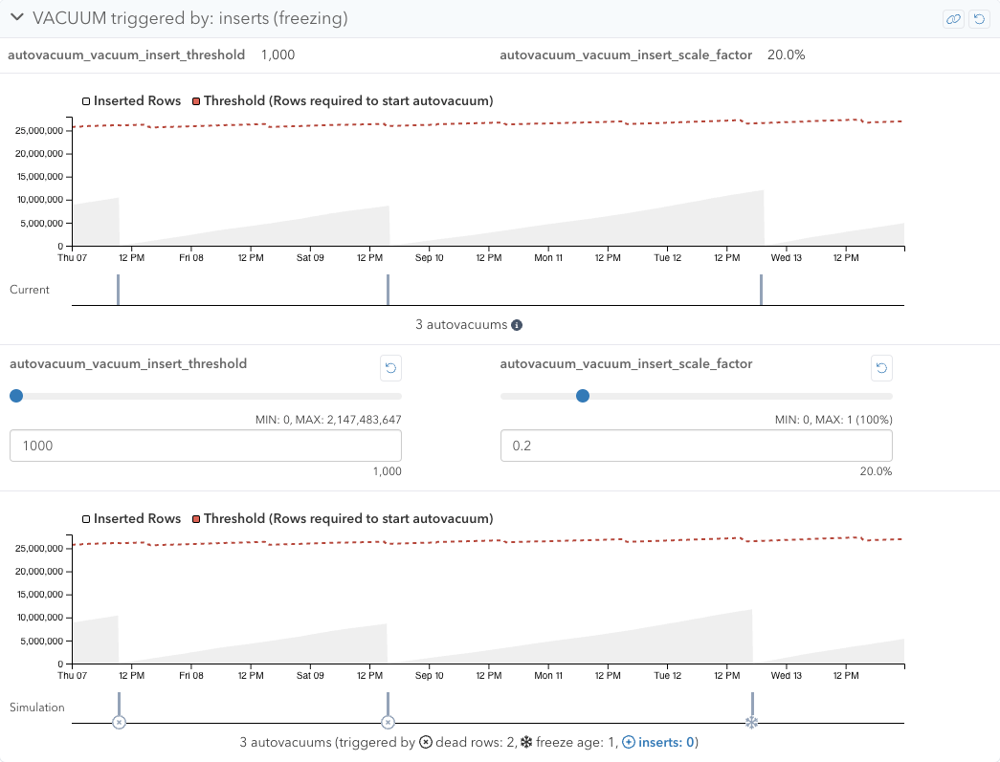

VACUUM Simulator lets you tweak autovacuum settings to learn the relationship
between Postgres configuration settings and autovacuum patterns.
It also helps you find better autovacuum settings for the table.

## Overview

Autovacuum can be triggered by the following 3 causes:

1. Triggered by dead rows
2. Triggered by freeze age
3. Triggered by inserts (Postgres 13 or above)

Each cause has related configuration settings. By tweaking these settings, you
can see changes in the simulation data.
There is a panel for each cause, and each panel has the actual value and graph
section to show how it was in the selected time range, and a simulation value
and graph section to show how it would be based on the collected statistics and
the adjusted configuration settings.
You can also create a permalink of your current simulation and modified settings
to share with your team members.

### Limitations

* The current autovacuum count can be much bigger than the simulation count with
  frequently autovacuumed tables, since the simulation can only perform
  autovacuum every 10 minutes. The simulation can still be useful to understand
  why so many vacuums are performed, and to explore ways to reduce autovacuum
  frequency.

## Triggered by dead rows

To prevent table bloat, Postgres runs autovacuums periodically to clean up dead
rows. You can learn more about bloat in the
[What is bloat?](/docs/vacuum-advisor/what-is-bloat) page.



When the number of dead rows exceeds the following threshold, dead rows
autovacuums will be triggered:

```
threshold = autovacuum_vacuum_threshold + autovacuum_vacuum_scale_factor * pg_class.reltuples
```

where `pg_class.reltuples` is the number of live rows in the table.

With VACUUM Simulator, you can tweak `autovacuum_vacuum_threshold` and
`autovacuum_vacuum_scale_factor` in this section. Lowering these configuration
settings usually triggers autovacuums more, as the threshold becomes lower and
the dead row count will reach the threshold more often.
You can first try lowering `autovacuum_vacuum_scale_factor` to see how it will
affect the behavior, before touching `autovacuum_vacuum_threshold`.

On the other hand, if you are observing too many autovacuums on a table, your
workload might be creating many dead rows compared to total live rows.
In that case, making `autovacuum_vacuum_scale_factor` 0 and adjusting
`autovacuum_vacuum_threshold` to a value that lowers the total autovacuum count.

This section also contains the graph of avoidable growth, calculated based on
the following factors:

* How many reusable rows are available (already VACUUMed rows)
* How many dead rows are there (to be VACUUMed rows)

Let's say there are 10 reusable rows and 20 dead rows. With this situation, if
30 rows are INSERTed:

1. Use 10 reusable rows
2. Use 20 totally new rows

However, if 20 dead rows were already VACUUMed at this point, the reusable rows
will be 30 rows and all INSERTs will use these reusable rows without acquiring
space for new rows. We'll consider these 20 dead rows as avoidable growth.
When the table is showing this pattern a lot, it indicates that autovacuums are
not running frequently enough. Try tweaking configuration settings to trigger
simulation autovacuums more often and see if avoidable growth decreases.

There is a specific insight for this in the [Alerts & Check-Up](/docs/checks/) system:
[Bloat - Insufficient VACUUM Frequency](/docs/checks/vacuum/insufficient_vacuum_frequency).

### Limitations

* The simulation data tends to trigger autovacuum earlier than the actual
  triggered timing, especially with tables with lots of UPDATEs.
  Occasionally, UPDATEs operations don't create dead rows, or even decrease dead
  rows when ["mini autovacuum"](https://pganalyze.com/blog/5mins-postgres-debug-UPDATE-bloated-tables-auto-explain-pageinspect#hot-pruning-in-postgres)
  happened with these operations.
  The current simulation can't represent this situation well, therefore dead
  rows simply keep increasing with UPDATEs and trigger autovacuum earlier.
* The avoidable growth graph may over report avoidable growth size.
  You can check the Estimated Table Bloat panel of Schema Statistics
  VACUUM/ANALYZE Activity page for the current estimated table bloat to assess
  the actual impact.


## Triggered by freeze age

To prevent transaction ID wraparound, Postgres runs autovacuums periodically to
freeze older rows (sometimes referred to as "freezing old transaction IDs").
You can learn more about freezing in the
[What is freezing?](/docs/vacuum-advisor/what-is-freezing) page.



When the age of the oldest unfrozen transaction ID exceeds
`autovacuum_freeze_max_age` (or the oldest unfrozen multixact ID exceeds
`autovacuum_multixact_freeze_max_age`), freeze age autovacuums will
be triggered. These autovacuums are called anti-wraparound autovacuums.

With VACUUM Simulator, you can tweak `autovacuum_freeze_max_age` and
`autovacuum_multixact_freeze_max_age` in this section.
`autovacuum_multixact_freeze_max_age` can be only tweaked if multixact IDs are
being used in your database. Lowering these configuration settings triggers
autovacuums more, and increasing these configuration settings will decrease
autovacuums triggered by freeze age.

### Limitations

* The simulation is using data of average transactions (or multixacts) per
  second (tps).
  If the tps varies a lot depending on the time of the day or day of the week,
  the simulation may look a lot different than the actual data.
* Autovacuums triggered by other causes usually try to freeze old rows.
  The simulation also freezes them, however, there are cases that freezing won't
  happen when there are nothing can be frozen.
  This can cause the transaction age to be reset even when it shouldn't be in
  the simulation, potentially cause the simulation to trigger less autovacuums
  by freeze age.


## Triggered by inserts

Since an append-only table won't generate any dead rows, autovacuum won't be
triggered by dead rows. It can still be triggered by freeze age, but depending
on the database workload, it can be a long time until it's triggered.
This can turn normal incremental maintenance into a resource-intensive,
long-running task that can impact database performance. To counteract this,
since Postgres 13, autovacuum can be triggered by INSERTs.
Autovacuum based on inserts is triggered to freeze old transaction IDs like
freeze age autovacuum, but more importantly, it is triggered to update a
visibility map.
Each table has a visibility map to keep track of which pages contain only tuples
that are known to be visible to all active transactions. For a case like an
append-only table, all pages of the table should be all-visible, and are likely
to stay all-visible moving forward (they will be flagged as not all-visible if
there is any write operation on that page).
However, Postgres doesn't know about this visibility metadata until VACUUM scans
the table and sets a flag.
Updating the visibility map helps index-only scans, as they will be able to
avoid reading table data to check visibility, improving performance.
During VACUUM of an append-only table, it is often able to mark pages as
all-frozen, in addition to all-visible, and it will stay that way (since these
rows will never be modified). This will improve performance for any subsequent
VACUUMs as pages that are both all-visible and all-frozen don't need to be
VACUUMed and will be skipped.
Updating the visibility map also helps index-only scans, as they will be able to
avoid reading the table data to check visibility, improving performance.



When the number of inserted rows (since the last VACUUM) exceeds the following
threshold, inserts autovacuums will be triggered:

```
threshold = autovacuum_vacuum_insert_threshold + autovacuum_vacuum_insert_scale_factor * pg_class.reltuples
```

where `pg_class.reltuples` is the number of live rows in the table.

With VACUUM Simulator, you can tweak `autovacuum_vacuum_insert_threshold` and
`autovacuum_vacuum_insert_scale_factor` in this section.
Lowering these configuration settings triggers autovacuums more with append-only
or append-mostly tables, though this rarely triggers autovacuums for other types
of tables.

If you are observing too many inserts autovacuums with the table, you can make
`autovacuum_vacuum_insert_scale_factor` 0 and adjust
`autovacuum_vacuum_insert_threshold` to find a reasonable threshold for inserts
autovacuums.

### Limitations

* This simulation is only available with servers running Postgres 13 or above.
