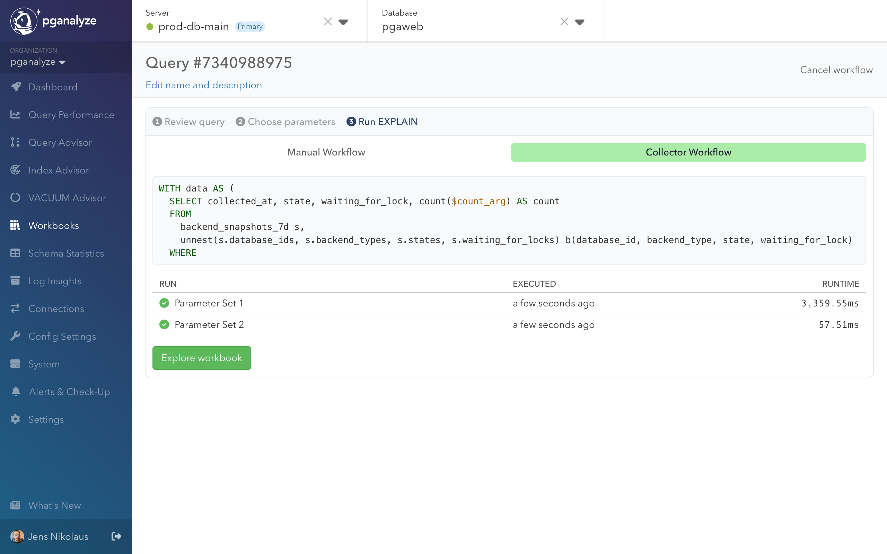

### Creating Your First Workbook

To begin optimizing your query, navigate to the query detail page where you'll
find the action "Create Workbook". This creates your first workbook
for the selected query.

### Review Your Query

Start by reviewing your query and parameter names.

### Choose Parameter Sets

Next, you'll set up parameter sets for testing - these could be values you commonly
use in production or specific edge cases you want to evaluate.

## Running Analysis

With your parameter sets defined, you can now run EXPLAIN ANALYZE using our collector,
or running it manually on your own and pasting the output.

## Understanding Performance

The workbook provides a comprehensive view of your query's performance:

* Examine key metrics including cost estimates, runtime, and I/O read time
* Review automated EXPLAIN analysis that highlights EXPLAIN insights
* Compare query performance across different parameter sets to understand behavior under various conditions

Next, dig into an EXPLAIN plan to find potential for optimization. We will highlight EXPLAIN insights for you.

## Optimizing Your Query

As you discover potential optimizations, create variants to test different approaches:

* Adjust Postgres planner settings
* Try query rewrites to improve performance
* Use the Compare Plans feature to visualize execution plan changes side by side

### Plan Comparison

The Compare Plans feature helps you understand exactly how execution strategies differ:

* View plans side by side to spot structural changes
* Identify whether performance variations come from plan shape or environmental factors like I/O time
* Track changes in join strategies, scan methods, and row estimates
* Visualize how different parameter sets affect plan choices

## Next Steps

Check out our guide on common optimization patterns to learn about specific scenarios you
might encounter and how to address them effectively.

[Continue with Query Optimization Examples](/docs/workbooks/query-optimization-examples)
