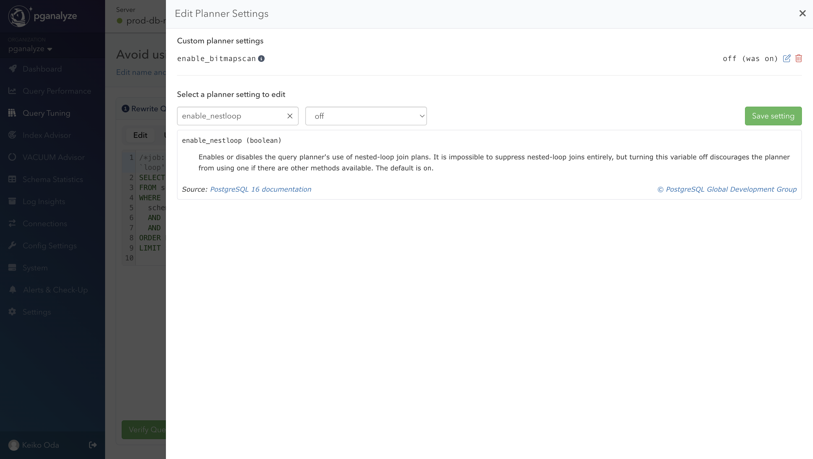
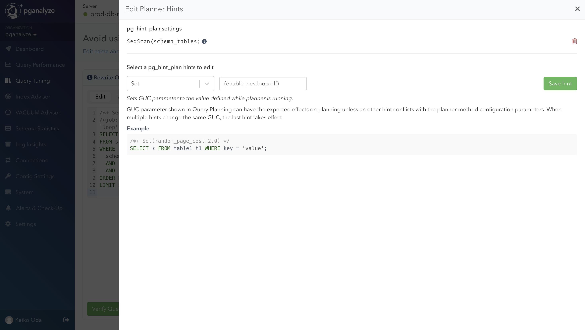
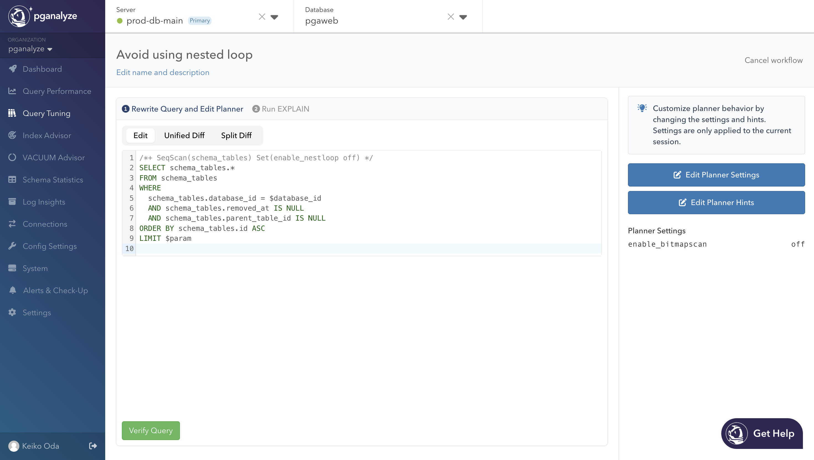

import DocsBetaFeature from '../components/DocsBetaFeature'

<DocsBetaFeature feature="Query Tuning" />

You can test optimizing queries by creating variants. In the rewrite query page
of the create new variant flow, you can not only rewrite a query, but also tweak
the planner settings and planner hints.

## Editing Planner Settings

In the Edit Planner Settings modal, you can tweak [the configuration parameters](https://www.postgresql.org/docs/current/runtime-config-query.html)
that influence the query plan chosen by the query optimizer.
These settings will be applied only to the current variant.

For instance, you can set the `enable_nestloop` to `off` to ensure that the
Nested Loop will not be used as the JOIN method in this variant.
You can only save the setting if its value differs from the default.
For `enable_nestloop`, the default value is `on`, so you can only set it to
`off`, unless the current global setting is `off`.

## Editing Planner Hints

The Edit Planner Hints modal helps you add `pg_hint_plan` hinting phrases to the
query. Pick a hint to add, then specify the value enclosed in parentheses.

When saving the hint, it is validated against the current query. It checks any
syntax errors, whether it will be used (e.g., if the hint specifies a table name
that does not exist in the query, it will be considered unused), or if it is
redundant or conflicts with existing hints.
Editing planner hints is only available when the database has `pg_hint_plan`
enabled.

When a new hint is saved, the query is updated with the hinting phrases. Unlike
hints, when a new planner setting is saved, it does not update the current query,
but you can see the changes in the sidebar.

